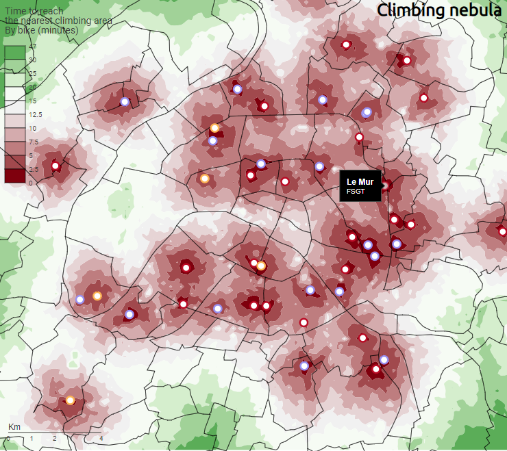

## Climbing in Paris 
### Travel time calculation with R and data visualization with Observable - Application to artificial climbing walls in Paris and its neighbourhood

The aim of this repository consists in showing how to build, visualize and reproduce accessibility indicators by combining points of interest (POI) coming from the OpenStreetMap database, socio-economic indicators included in small territorial division (IRIS) coming from institutional data source (INSEE) and routing engines (OSRM). It is applied to sport climbing in Paris, but this example could be easily extended to other areas of interest or other amenities (OpenStreetMap key-values).

- To introduce the reader to the issues raised by indoor sport-climbing in Paris, have a look to [this notebook](https://observablehq.com/@rysebaert/forewords?collection=@rysebaert/climbing_paris).
- The graphical outputs displayed in this notebook are also available in an [Observable collection](https://observablehq.com/collection/@rysebaert/climbing_paris).
- The methodological framework is detailed in a [Quarto document](https://rysebaert.github.io/climbing_paris/), which combines 2 computer languages : R for data processing and Observable JavaScript for data visualizations. 

